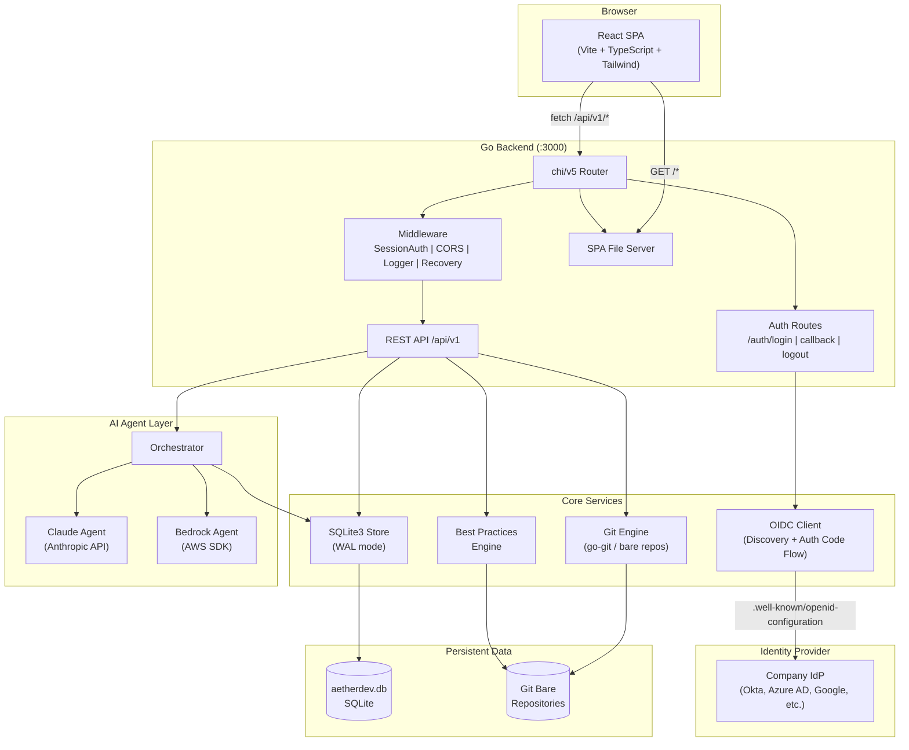
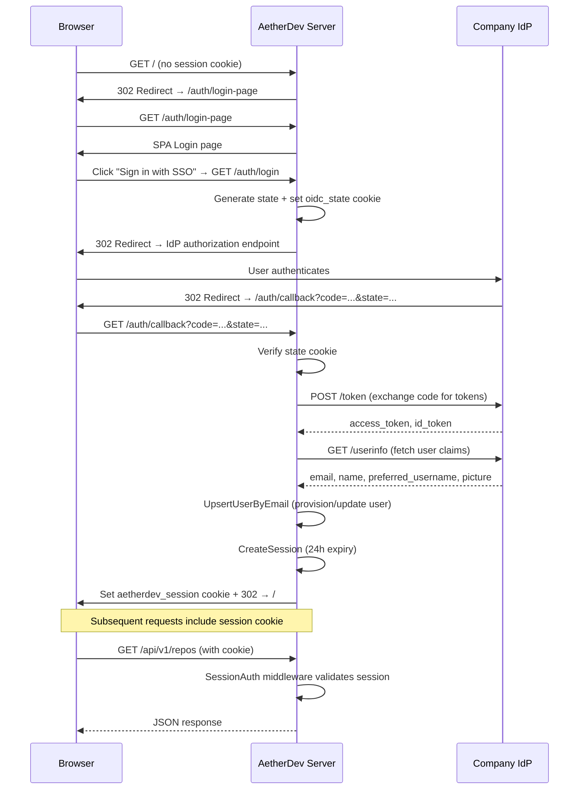
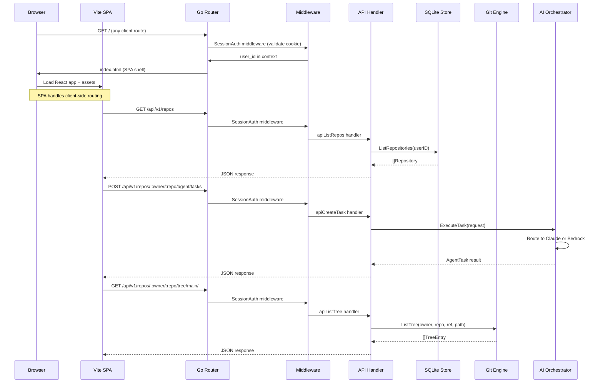
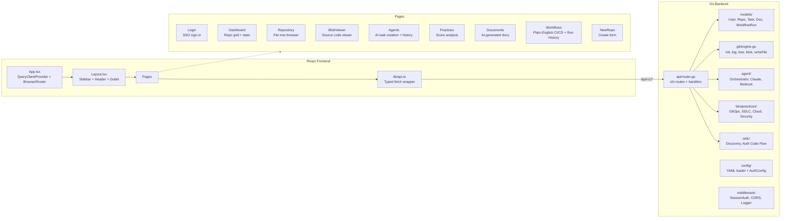
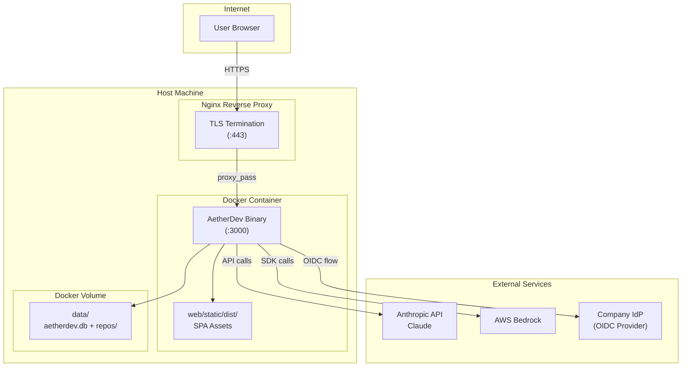
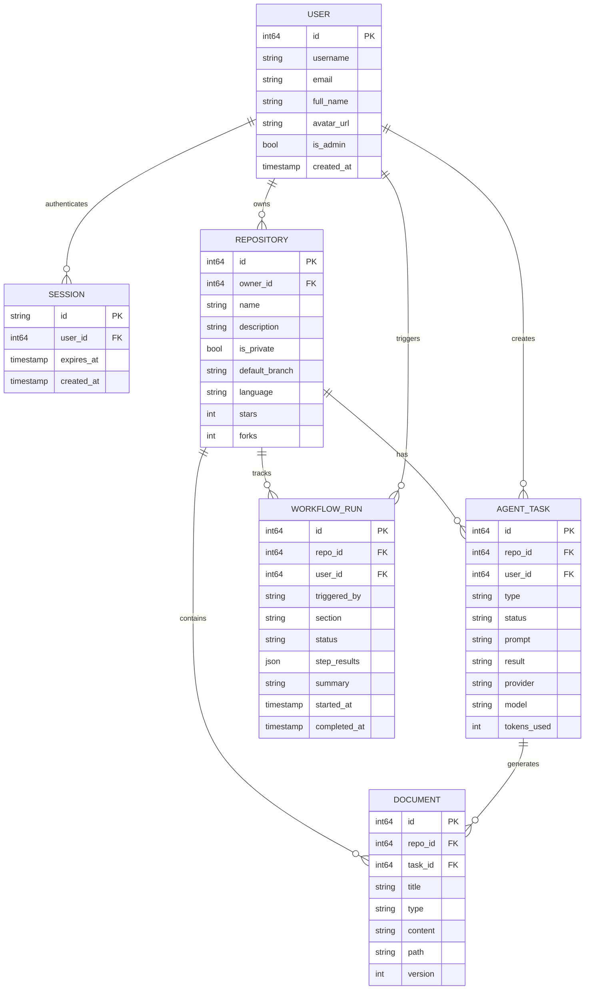

# AetherDev

A self-hosted Git repository management platform with built-in AI agent capabilities. AetherDev combines Gitea-style repository hosting with AI-powered code review, generation, documentation, and best practice analysis via Anthropic Claude and AWS Bedrock. Designed for enterprise teams with OIDC/SSO authentication and plain-English CI/CD workflows.

## Tech Stack

| Layer | Technology |
|-------|------------|
| Backend | Go 1.22, chi/v5 router, go-git, SQLite3 |
| Frontend | React 18, TypeScript, Vite 7, Tailwind CSS v4 |
| Data Fetching | TanStack React Query |
| AI Agents | Anthropic Claude API, AWS Bedrock |
| Authentication | OIDC Authorization Code Flow (any OpenID Connect provider) |
| Icons | Lucide React |

## Architecture

### System Overview



### Authentication Flow (OIDC)



### Request Flow



### Component Architecture



### Deployment Architecture (Docker)



### Data Model



---

## Prerequisites

- **Go** 1.22+ ([install](https://go.dev/dl/))
- **Node.js** 20+ and npm ([install](https://nodejs.org/))
- **Git** 2.x+ (for bare repository management)
- **GCC** (required for SQLite3 CGO compilation)

For Docker deployment only **Docker** and **Docker Compose** are required.

---

## Quick Start (Local Development)

### 1. Clone the repository

```bash
git clone https://github.com/kondalaraogangavarapu/custom-gitea.git
cd custom-gitea
```

### 2. Install frontend dependencies and build

```bash
cd web/frontend
npm install
npm run build
cd ../..
```

This compiles the React SPA into `web/static/dist/`, which the Go server serves.

### 3. Configure (optional)

Create an `aetherdev.yaml` in the project root. The app works without it using defaults (no OIDC, default admin user).

```yaml
server:
  port: 3000
  host: 0.0.0.0
  secret_key: change-me-in-production
  base_url: https://aetherdev.example.com  # Required for OIDC redirect URI

data_dir: ./data

# Enterprise SSO — supply your company's OIDC provider details
auth:
  oidc_enabled: true
  issuer_url: https://accounts.google.com              # or your company IdP
  client_id: your-client-id
  client_secret: your-client-secret
  scopes:                                               # optional, defaults below
    - openid
    - profile
    - email

agent:
  claude_api_key: ${CLAUDE_API_KEY}
  claude_model: claude-sonnet-4-20250514
  aws_region: us-east-1
  aws_agent_id: ${AWS_AGENT_ID}
  aws_agent_alias_id: ${AWS_AGENT_ALIAS_ID}
  enable_auto_review: true
  enable_auto_fix: false

cloud:
  provider: aws
  default_region: us-east-1
  iac_framework: terraform
  enable_cost_guard: true
  enable_compliance: true

branding:
  app_name: AetherDev
  logo_path: /static/img/logo.svg
  theme: dark
  accent: "#6C5CE7"
```

### 4. Run the Go backend

```bash
# Install Go dependencies
go mod download

# Build and run (CGO_ENABLED=1 required for SQLite3)
CGO_ENABLED=1 go build -o bin/aetherdev ./cmd/aetherdev
./bin/aetherdev
```

The server starts at **http://localhost:3000**.

### 5. Frontend development mode (optional)

For hot-reloading during frontend development, run the Vite dev server alongside the Go backend:

```bash
# Terminal 1: Go backend
./bin/aetherdev

# Terminal 2: Vite dev server (proxies /api to Go backend)
cd web/frontend
npm run dev
```

The Vite dev server runs at **http://localhost:5173** with:
- Hot Module Replacement (HMR) for instant UI updates
- Automatic API proxy to the Go backend on port 3000

---

## Enterprise SSO (OIDC)

AetherDev supports OpenID Connect for enterprise single sign-on. Supply your company's `.well-known` discovery URL and AetherDev handles the rest — user provisioning, session management, and logout.

### Supported Providers

Any OIDC-compliant identity provider works, including:

| Provider | Issuer URL Example |
|----------|-------------------|
| Google Workspace | `https://accounts.google.com` |
| Microsoft Entra ID | `https://login.microsoftonline.com/{tenant}/v2.0` |
| Okta | `https://{domain}.okta.com` |
| Auth0 | `https://{domain}.auth0.com/` |
| Keycloak | `https://{host}/realms/{realm}` |
| GitLab | `https://gitlab.com` |

### Setup Steps

1. Register AetherDev as an application in your IdP
2. Set the **redirect URI** to `https://your-domain.com/auth/callback`
3. Note the **client ID** and **client secret**
4. Add the config to `aetherdev.yaml`:

```yaml
server:
  base_url: https://aetherdev.example.com

auth:
  oidc_enabled: true
  issuer_url: https://login.microsoftonline.com/{tenant}/v2.0
  client_id: xxxxxxxx-xxxx-xxxx-xxxx-xxxxxxxxxxxx
  client_secret: your-secret
```

### How It Works

- AetherDev fetches `{issuer_url}/.well-known/openid-configuration` at startup to auto-discover all endpoints (authorization, token, userinfo, logout)
- Users clicking "Sign in with SSO" are redirected to the IdP
- After authentication, the IdP redirects back with an authorization code
- AetherDev exchanges the code for tokens, fetches user info, and creates/updates the user record
- A 24-hour session cookie (`aetherdev_session`) is set
- When OIDC is disabled (default), all requests use the built-in admin user for backward compatibility

---

## Workflows

AetherDev takes a file-first approach to CI/CD. Instead of YAML pipelines or scripted configurations, workflows are written as **plain English** in a Markdown file committed to the repository at `.aetherdev/workflows.md`.

AI agents read and execute these instructions in isolated sandboxes. There is no special syntax — agents understand English.

### Example Workflow File

```markdown
# AetherDev Workflows

## On every pull request
1. Run the full test suite with coverage
2. Check for linting errors and auto-fix if possible
3. Generate a code review summary

## Before release
1. Run security audit on all dependencies
2. Build Docker image and tag it with the version number
3. Run integration tests against staging
4. Generate release notes from recent commits

## Nightly maintenance
1. Check for outdated dependencies and open a PR if updates are available
2. Run the full best practices analysis
3. Clean up stale branches older than 30 days
```

### Workflow Run Tracking

Every workflow execution is tracked for observability:
- **Who triggered it** — username or agent that initiated the run
- **Which section** — which `## ` heading from the workflow file was executed
- **Step-by-step results** — status and output for each numbered step
- **Live status** — pending, running, completed, or failed
- **Full history** — browse all past runs from the Workflows page

---

## Docker Deployment

### Option A: Docker Compose (recommended)

```bash
# Set your API keys
export CLAUDE_API_KEY=sk-ant-...

# Build and run
docker compose up -d

# View logs
docker compose logs -f aetherdev

# Stop
docker compose down
```

### Option B: Docker standalone

```bash
# Build the image
docker build -t aetherdev .

# Run the container
docker run -d \
  --name aetherdev \
  -p 3000:3000 \
  -v aetherdev-data:/home/aetherdev/data \
  -e CLAUDE_API_KEY=sk-ant-... \
  aetherdev
```

The app is available at **http://localhost:3000**.

Data (SQLite database and git repositories) is persisted in the `aetherdev-data` volume.

---

## Production Deployment

### Building for production

```bash
# Build frontend
cd web/frontend && npm ci && npm run build && cd ../..

# Build Go binary with version info
CGO_ENABLED=1 go build \
  -ldflags="-s -w -X main.Version=0.1.0 -X main.BuildDate=$(date -u +%Y-%m-%dT%H:%M:%SZ)" \
  -o bin/aetherdev ./cmd/aetherdev
```

### Deploy to a Linux server

```bash
# 1. Copy the binary, web assets, and config
scp bin/aetherdev yourserver:/opt/aetherdev/
scp -r web/static/ yourserver:/opt/aetherdev/web/static/
scp -r web/templates/ yourserver:/opt/aetherdev/web/templates/
scp aetherdev.yaml yourserver:/opt/aetherdev/

# 2. SSH in and set up
ssh yourserver
cd /opt/aetherdev
chmod +x aetherdev
mkdir -p data
```

### Systemd service

Create `/etc/systemd/system/aetherdev.service`:

```ini
[Unit]
Description=AetherDev Git Platform
After=network.target

[Service]
Type=simple
User=aetherdev
Group=aetherdev
WorkingDirectory=/opt/aetherdev
ExecStart=/opt/aetherdev/aetherdev --config /opt/aetherdev/aetherdev.yaml --data /opt/aetherdev/data
Restart=on-failure
RestartSec=5
Environment=CLAUDE_API_KEY=sk-ant-...

[Install]
WantedBy=multi-user.target
```

```bash
# Create the user and set permissions
sudo useradd -r -s /bin/false aetherdev
sudo chown -R aetherdev:aetherdev /opt/aetherdev

# Enable and start the service
sudo systemctl daemon-reload
sudo systemctl enable aetherdev
sudo systemctl start aetherdev

# Check status
sudo systemctl status aetherdev
sudo journalctl -u aetherdev -f
```

### Reverse proxy (Nginx)

```nginx
server {
    listen 80;
    server_name aetherdev.example.com;

    client_max_body_size 100m;

    location / {
        proxy_pass http://127.0.0.1:3000;
        proxy_set_header Host $host;
        proxy_set_header X-Real-IP $remote_addr;
        proxy_set_header X-Forwarded-For $proxy_add_x_forwarded_for;
        proxy_set_header X-Forwarded-Proto $scheme;
    }
}
```

For HTTPS, add Certbot:

```bash
sudo apt install certbot python3-certbot-nginx
sudo certbot --nginx -d aetherdev.example.com
```

---

## CLI Flags

```
Usage: aetherdev [flags]

Flags:
  --config string   Path to configuration file (default "aetherdev.yaml")
  --port int        Server port (default 3000)
  --data string     Data directory for repos and DB (default "./data")
  --version         Show version info
```

## Environment Variables

| Variable | Description |
|----------|-------------|
| `CLAUDE_API_KEY` | Anthropic Claude API key for AI agent features |
| `AWS_REGION` | AWS region for Bedrock (default: `us-east-1`) |
| `AWS_AGENT_ID` | AWS Bedrock agent ID |
| `AWS_AGENT_ALIAS_ID` | AWS Bedrock agent alias ID |

---

## Project Structure

```
├── cmd/aetherdev/          # Application entry point
│   └── main.go
├── internal/
│   ├── agent/              # AI agent orchestration (Claude, Bedrock)
│   ├── api/                # HTTP router, handlers, SPA serving
│   ├── bestpractices/      # Code quality analysis engine
│   ├── config/             # YAML configuration loader (server, auth, agent)
│   ├── git/                # Git bare repository operations (read + write)
│   ├── middleware/          # HTTP middleware (session auth, CORS, logging)
│   ├── models/             # Data models and SQLite store
│   └── oidc/               # OpenID Connect client (discovery, auth code flow)
├── web/
│   ├── frontend/           # Vite + React + TypeScript SPA
│   │   ├── src/
│   │   │   ├── components/ # Layout, Sidebar, Header
│   │   │   ├── pages/      # Login, Dashboard, Repository, Agents, Workflows, etc.
│   │   │   ├── lib/        # API client (auth, repos, agents, workflows)
│   │   │   └── types.ts    # TypeScript interfaces
│   │   ├── package.json
│   │   └── vite.config.ts
│   ├── static/             # Static assets (CSS, images, build output)
│   └── templates/          # Go HTML templates (legacy fallback)
├── Dockerfile              # Multi-stage Docker build
├── docker-compose.yml      # Docker Compose config
├── go.mod                  # Go module dependencies
└── aetherdev.yaml          # Configuration file (create this)
```

## API Endpoints

### Authentication

| Method | Endpoint | Description |
|--------|----------|-------------|
| GET | `/auth/login` | Initiate OIDC login (redirects to IdP) |
| GET | `/auth/callback` | OIDC callback (exchanges code for session) |
| GET | `/auth/logout` | Clear session and redirect to IdP logout |
| GET | `/auth/login-page` | Serve SPA login page |
| GET | `/api/v1/auth/me` | Get current authenticated user |

### Repositories

| Method | Endpoint | Description |
|--------|----------|-------------|
| GET | `/api/v1/repos` | List repositories |
| POST | `/api/v1/repos` | Create repository |
| GET | `/api/v1/repos/:owner/:repo` | Get repository details |
| GET | `/api/v1/repos/:owner/:repo/branches` | List branches |
| GET | `/api/v1/repos/:owner/:repo/commits/:ref` | List commits |
| GET | `/api/v1/repos/:owner/:repo/tree/:ref/*` | List file tree |
| GET | `/api/v1/repos/:owner/:repo/blob/:ref/*` | Read file content |

### AI Agents

| Method | Endpoint | Description |
|--------|----------|-------------|
| POST | `/api/v1/repos/:owner/:repo/agent/tasks` | Create AI agent task |
| GET | `/api/v1/repos/:owner/:repo/agent/tasks` | List agent tasks |

### Documents

| Method | Endpoint | Description |
|--------|----------|-------------|
| GET | `/api/v1/repos/:owner/:repo/documents` | List documents |

### Best Practices

| Method | Endpoint | Description |
|--------|----------|-------------|
| GET | `/api/v1/repos/:owner/:repo/practices` | Analyze best practices |

### Workflows

| Method | Endpoint | Description |
|--------|----------|-------------|
| GET | `/api/v1/repos/:owner/:repo/workflows/file` | Read workflow file (`.aetherdev/workflows.md`) |
| PUT | `/api/v1/repos/:owner/:repo/workflows/file` | Save workflow file (plain-English CI/CD steps) |
| GET | `/api/v1/repos/:owner/:repo/workflows/runs` | List workflow run history |
| POST | `/api/v1/repos/:owner/:repo/workflows/runs` | Create a workflow run record |
| GET | `/api/v1/repos/:owner/:repo/workflows/runs/:id` | Get workflow run detail with step results |
| PUT | `/api/v1/repos/:owner/:repo/workflows/runs/:id` | Update workflow run status and results |

### System

| Method | Endpoint | Description |
|--------|----------|-------------|
| GET | `/api/v1/health` | Health check |
| GET | `/api/v1/version` | Version info |

## License

MIT
