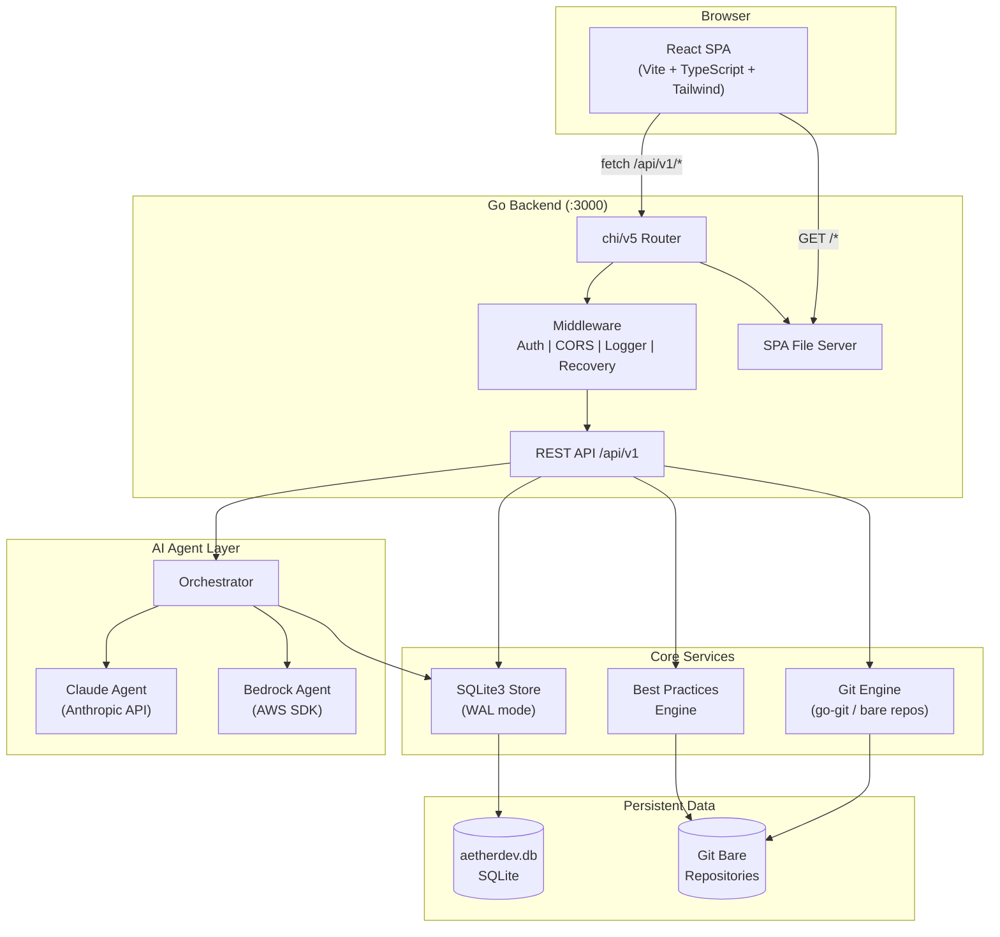
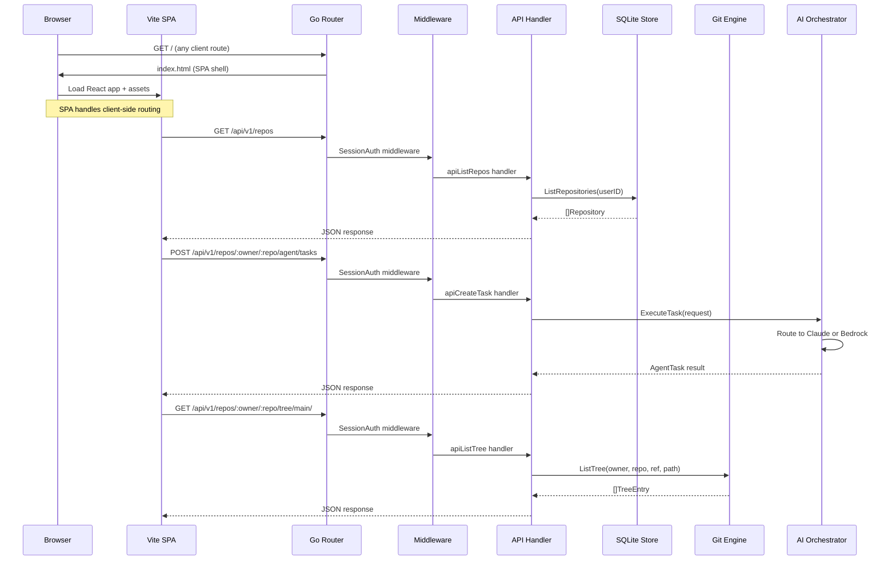
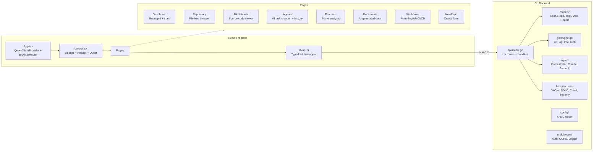
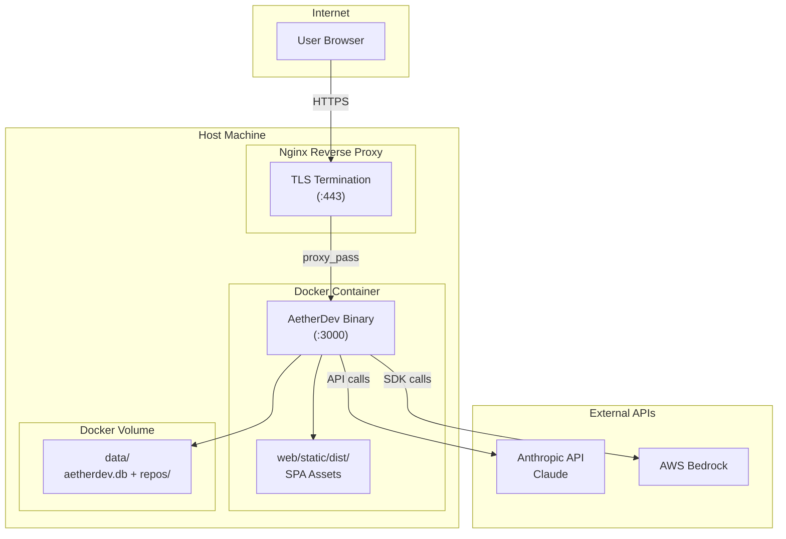
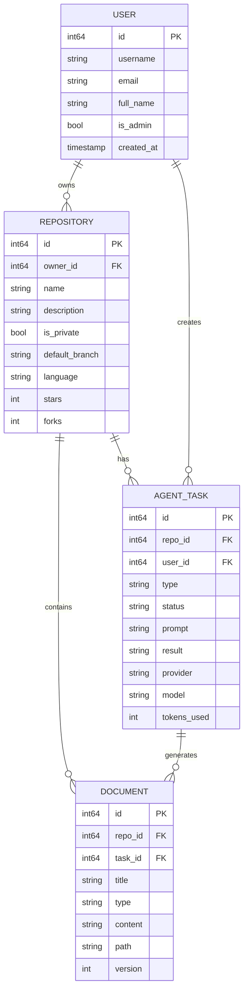

# AetherDev

A self-hosted Git repository management platform with built-in AI agent capabilities. AetherDev combines Gitea-style repository hosting with AI-powered code review, generation, documentation, and best practice analysis via Anthropic Claude and AWS Bedrock.

## Tech Stack

| Layer | Technology |
|-------|------------|
| Backend | Go 1.22, chi/v5 router, go-git, SQLite3 |
| Frontend | React 18, TypeScript, Vite 7, Tailwind CSS v4 |
| Data Fetching | TanStack React Query |
| AI Agents | Anthropic Claude API, AWS Bedrock |
| Icons | Lucide React |

## Architecture

### System Overview



### Request Flow



### Component Architecture



### Deployment Architecture (Docker)



### Data Model



---

## Prerequisites

- **Go** 1.22+ ([install](https://go.dev/dl/))
- **Node.js** 20+ and npm ([install](https://nodejs.org/))
- **Git** 2.x+ (for bare repository management)
- **GCC** (required for SQLite3 CGO compilation)

For Docker deployment only **Docker** and **Docker Compose** are required.

---

## Quick Start (Local Development)

### 1. Clone the repository

```bash
git clone https://github.com/kondalaraogangavarapu/custom-gitea.git
cd custom-gitea
```

### 2. Install frontend dependencies and build

```bash
cd web/frontend
npm install
npm run build
cd ../..
```

This compiles the React SPA into `web/static/dist/`, which the Go server serves.

### 3. Configure (optional)

Create an `aetherdev.yaml` in the project root. The app works without it using defaults.

```yaml
server:
  port: 3000
  host: 0.0.0.0
  secret_key: change-me-in-production

data_dir: ./data

agent:
  claude_api_key: ${CLAUDE_API_KEY}
  claude_model: claude-sonnet-4-20250514
  aws_region: us-east-1
  aws_agent_id: ${AWS_AGENT_ID}
  aws_agent_alias_id: ${AWS_AGENT_ALIAS_ID}
  enable_auto_review: true
  enable_auto_fix: false

cloud:
  provider: aws
  default_region: us-east-1
  iac_framework: terraform
  enable_cost_guard: true
  enable_compliance: true

branding:
  app_name: AetherDev
  logo_path: /static/img/logo.svg
  theme: dark
  accent: "#6C5CE7"
```

### 4. Run the Go backend

```bash
# Install Go dependencies
go mod download

# Build and run (CGO_ENABLED=1 required for SQLite3)
CGO_ENABLED=1 go build -o bin/aetherdev ./cmd/aetherdev
./bin/aetherdev
```

The server starts at **http://localhost:3000**.

### 5. Frontend development mode (optional)

For hot-reloading during frontend development, run the Vite dev server alongside the Go backend:

```bash
# Terminal 1: Go backend
./bin/aetherdev

# Terminal 2: Vite dev server (proxies /api to Go backend)
cd web/frontend
npm run dev
```

The Vite dev server runs at **http://localhost:5173** with:
- Hot Module Replacement (HMR) for instant UI updates
- Automatic API proxy to the Go backend on port 3000

---

## Docker Deployment

### Option A: Docker Compose (recommended)

```bash
# Set your API keys
export CLAUDE_API_KEY=sk-ant-...

# Build and run
docker compose up -d

# View logs
docker compose logs -f aetherdev

# Stop
docker compose down
```

### Option B: Docker standalone

```bash
# Build the image
docker build -t aetherdev .

# Run the container
docker run -d \
  --name aetherdev \
  -p 3000:3000 \
  -v aetherdev-data:/home/aetherdev/data \
  -e CLAUDE_API_KEY=sk-ant-... \
  aetherdev
```

The app is available at **http://localhost:3000**.

Data (SQLite database and git repositories) is persisted in the `aetherdev-data` volume.

---

## Production Deployment

### Building for production

```bash
# Build frontend
cd web/frontend && npm ci && npm run build && cd ../..

# Build Go binary with version info
CGO_ENABLED=1 go build \
  -ldflags="-s -w -X main.Version=0.1.0 -X main.BuildDate=$(date -u +%Y-%m-%dT%H:%M:%SZ)" \
  -o bin/aetherdev ./cmd/aetherdev
```

### Deploy to a Linux server

```bash
# 1. Copy the binary, web assets, and config
scp bin/aetherdev yourserver:/opt/aetherdev/
scp -r web/static/ yourserver:/opt/aetherdev/web/static/
scp -r web/templates/ yourserver:/opt/aetherdev/web/templates/
scp aetherdev.yaml yourserver:/opt/aetherdev/

# 2. SSH in and set up
ssh yourserver
cd /opt/aetherdev
chmod +x aetherdev
mkdir -p data
```

### Systemd service

Create `/etc/systemd/system/aetherdev.service`:

```ini
[Unit]
Description=AetherDev Git Platform
After=network.target

[Service]
Type=simple
User=aetherdev
Group=aetherdev
WorkingDirectory=/opt/aetherdev
ExecStart=/opt/aetherdev/aetherdev --config /opt/aetherdev/aetherdev.yaml --data /opt/aetherdev/data
Restart=on-failure
RestartSec=5
Environment=CLAUDE_API_KEY=sk-ant-...

[Install]
WantedBy=multi-user.target
```

```bash
# Create the user and set permissions
sudo useradd -r -s /bin/false aetherdev
sudo chown -R aetherdev:aetherdev /opt/aetherdev

# Enable and start the service
sudo systemctl daemon-reload
sudo systemctl enable aetherdev
sudo systemctl start aetherdev

# Check status
sudo systemctl status aetherdev
sudo journalctl -u aetherdev -f
```

### Reverse proxy (Nginx)

```nginx
server {
    listen 80;
    server_name aetherdev.example.com;

    client_max_body_size 100m;

    location / {
        proxy_pass http://127.0.0.1:3000;
        proxy_set_header Host $host;
        proxy_set_header X-Real-IP $remote_addr;
        proxy_set_header X-Forwarded-For $proxy_add_x_forwarded_for;
        proxy_set_header X-Forwarded-Proto $scheme;
    }
}
```

For HTTPS, add Certbot:

```bash
sudo apt install certbot python3-certbot-nginx
sudo certbot --nginx -d aetherdev.example.com
```

---

## CLI Flags

```
Usage: aetherdev [flags]

Flags:
  --config string   Path to configuration file (default "aetherdev.yaml")
  --port int        Server port (default 3000)
  --data string     Data directory for repos and DB (default "./data")
  --version         Show version info
```

## Environment Variables

| Variable | Description |
|----------|-------------|
| `CLAUDE_API_KEY` | Anthropic Claude API key for AI agent features |
| `AWS_REGION` | AWS region for Bedrock (default: `us-east-1`) |
| `AWS_AGENT_ID` | AWS Bedrock agent ID |
| `AWS_AGENT_ALIAS_ID` | AWS Bedrock agent alias ID |

---

## Project Structure

```
├── cmd/aetherdev/          # Application entry point
│   └── main.go
├── internal/
│   ├── agent/              # AI agent orchestration (Claude, Bedrock)
│   ├── api/                # HTTP router, handlers, SPA serving
│   ├── bestpractices/      # Code quality analysis engine
│   ├── config/             # YAML configuration loader
│   ├── git/                # Git bare repository operations
│   ├── middleware/          # HTTP middleware (auth, CORS, logging)
│   └── models/             # Data models and SQLite store
├── web/
│   ├── frontend/           # Vite + React + TypeScript SPA
│   │   ├── src/
│   │   │   ├── components/ # Layout, Sidebar, Header
│   │   │   ├── pages/      # Dashboard, Repository, Agents, etc.
│   │   │   ├── lib/        # API client
│   │   │   └── types.ts    # TypeScript interfaces
│   │   ├── package.json
│   │   └── vite.config.ts
│   ├── static/             # Static assets (CSS, images, build output)
│   └── templates/          # Go HTML templates (legacy fallback)
├── Dockerfile              # Multi-stage Docker build
├── docker-compose.yml      # Docker Compose config
├── go.mod                  # Go module dependencies
└── aetherdev.yaml          # Configuration file (create this)
```

## API Endpoints

| Method | Endpoint | Description |
|--------|----------|-------------|
| GET | `/api/v1/repos` | List repositories |
| POST | `/api/v1/repos` | Create repository |
| GET | `/api/v1/repos/:owner/:repo` | Get repository details |
| GET | `/api/v1/repos/:owner/:repo/branches` | List branches |
| GET | `/api/v1/repos/:owner/:repo/commits/:ref` | List commits |
| GET | `/api/v1/repos/:owner/:repo/tree/:ref/*` | List file tree |
| GET | `/api/v1/repos/:owner/:repo/blob/:ref/*` | Read file content |
| POST | `/api/v1/repos/:owner/:repo/agent/tasks` | Create AI agent task |
| GET | `/api/v1/repos/:owner/:repo/agent/tasks` | List agent tasks |
| GET | `/api/v1/repos/:owner/:repo/documents` | List documents |
| GET | `/api/v1/repos/:owner/:repo/practices` | Analyze best practices |
| GET | `/api/v1/repos/:owner/:repo/workflows/file` | Read workflow file (.aetherdev/workflows.md) |
| PUT | `/api/v1/repos/:owner/:repo/workflows/file` | Save workflow file (plain-English CI/CD steps) |
| GET | `/api/v1/repos/:owner/:repo/workflows/runs` | List workflow run history |
| POST | `/api/v1/repos/:owner/:repo/workflows/runs` | Create a workflow run record |
| GET | `/api/v1/repos/:owner/:repo/workflows/runs/:id` | Get workflow run detail with step results |
| PUT | `/api/v1/repos/:owner/:repo/workflows/runs/:id` | Update workflow run status and results |
| GET | `/api/v1/health` | Health check |
| GET | `/api/v1/version` | Version info |

## License

MIT
